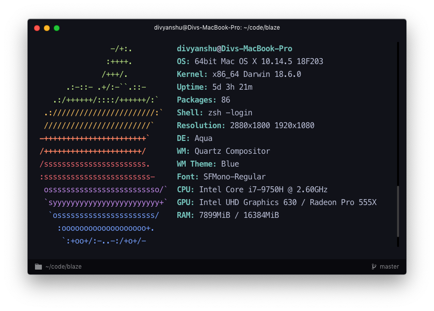

<header align="center">
    <div align="center">
        
    </div>
    <h1 align="center">Hyper Material Darker</h1>
    <p align="center">A material inspired dark theme for hyper with good contrast ratio</p>
</header>

## Installation

1. In your hyper configuration file at `~/.hyper.js` add `hyper-material-darker` in the plugins array:

```js
plugins: [
    ...
    'hyper-material-darker'
    ...
]
```

2. Reload or restart hyper

## Related

- [Mac dev setup](https://github.com/divyanshu013/mac-dev-setup)
- [Dotfiles with hyper settings](https://github.com/divyanshu013/dotfiles/)

## Author

- [@divyanshu013](https://twitter.com/divyanshu013) 👋
